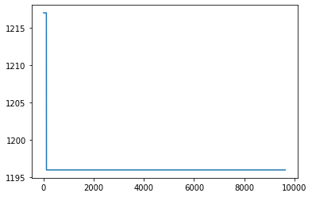

## Part 1 (Random Sample Algorithm)
### 1st Graph:
- We can see here how the makespan progress with the instance "abz7". \

### 2nd Graph:
- We can see here how the makespan progress with the instance "la24". \

### 3rd Graph:
- We can see here how the makespan progress with the instance "swv15". \

### 4th Graph:
- We can see here how the makespan progress with the instance "yn4". \

## Part 2 (Genetic Algorithm)
### 1st Graph:
- We can see here how the makespan progress with the instance "abz7".  \

### 2nd Graph:
- We can see here how the makespan progress with the instance "la24". \

### 3rd Graph:
- We can see here how the makespan progress with the instance "swv15". \

### 4th Graph:
- We can see here how the makespan progress with the instance "yn4". \
 
## Conclusions
- The Random Sample algorithm give us better solutions for the jssp problem.
- The Random Sample algorithm takes less time per loop to run. That's why it founds more soluttions to the same instance.
- The Genetic algorithm barely improves over time. 
- This is a basic Genetic Algorithm, it can be improved to find better results.
- Sometimes, it may be better to just go with random solutions.
